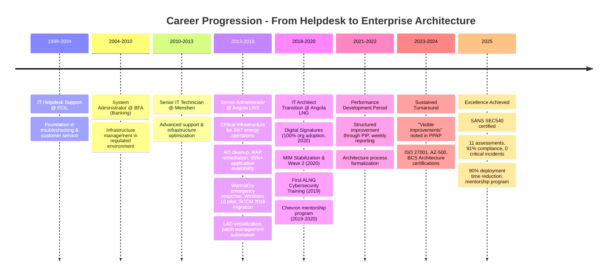

# 👋 Hi, I'm Cláudio Gonçalves (@clrogon)

[](https://github.com/clrogon?tab=followers)
[](https://www.linkedin.com/in/clgon)
[](https://www.infosecconnect.ao)
[](https://twitter.com/clrogon)
[](https://www.freecodecamp.org/clrogon)
[](https://www.credly.com/users/clrogon/badges)


**Senior IT Solutions Architect | SANS SEC540 Certified | Cloud Security & DevSecOps Specialist**

20+ years building enterprise IT infrastructure and cloud security solutions across Angola's banking and energy sectors. Currently designing critical systems at [Angola LNG](https://www.angolalng.com/) that power 24/7 energy operations with 99.9% reliability.

```yaml
current_role:
  title: "IT Solutions Architect"
  company: "Angola LNG OPCO"
  location: "Luanda, Angola"
  focus:
    - "Cloud security architecture (Azure)"
    - "DevSecOps automation"
    - "Enterprise systems integration"
    - "IT/OT convergence"
    - "Digital transformation"
```

---

## 🚀 2025 Impact Metrics

```typescript
const achievements2025 = {
  certification: "SANS SEC540: Cloud Security & DevSecOps Automation ✅",
  architectureAssessments: 11,
  implementationCompliance: "91%",
  criticalIncidents: 0,
  intuneAutomation: {
    timeReduction: "90%",
    before: "2-3 hours per workstation",
    after: "15-20 minutes per workstation",
    status: "Enterprise template adopted"
  },
  entraIDProvisioning: {
    manualHoursEliminated: "~40 hours/month",
    benefit: "Improved security compliance"
  },
  mentorshipProgram: {
    skillImprovement: "47.5%",
    participants: ["Server Team", "End User Support"],
    format: "Bi-weekly sessions with documented milestones"
  },
  uptime: "99.9%"
};
```

**Translation:** Designed 11 production architectures with zero critical failures, automated deployments saving 90% of installation time, and eliminated 40+ hours of monthly manual work—all while mentoring team members to 47.5% skill improvement.

---

## 🔭 Current Focus

- 🏗️ **Enterprise Architecture & Strategic Planning** — Designing scalable, secure solutions for industrial operations
- 🔒 **Cloud Security & DevSecOps** — Implementing Zero Trust architecture and security automation
- ☁️ **Cloud Governance** — Azure architecture, hybrid infrastructure, IAM at scale
- 🏭 **IT/OT Convergence** — Bridging information technology and operational technology in energy sector
- 🎓 **Knowledge Sharing** — Mentoring emerging IT professionals and contributing to Angola's tech community

---

## 🛠️ Technology Stack

### Cloud & Infrastructure
<p>
  
  
  
  
  
</p>

### Security & Compliance
<p>
  
  
  
  
  
</p>

### Automation & Development
<p>
  
  
  
  
  
  
</p>

### Enterprise Systems
<p>
  
  
  
</p>

---

## 💼 Professional Journey



---

## 🎓 Certifications & Continuous Learning

### 🏆 Elite Security & Governance (Active)

<details open>
<summary><b>Click to view active certifications</b></summary>

#### SANS Institute
- ✅ **SEC540: Cloud Security and DevSecOps Automation** (Jun 2025)
  - Credential: `29720485`
  - Focus: Cloud-native security, DevSecOps pipelines, infrastructure-as-code security

#### ISC2
- ✅ **Certified in Cybersecurity (CC)** — Domains 1-3 (Sep 2024 – Sep 2027)
  - Credential: `8cb11164-8d1c-4421-b5df-220339732fca`
  - **Security Principles** — Fundamental security concepts and controls
  - **Incident Response, Business Continuity & Disaster Recovery** — Response planning and resilience
  - **Access Control Concepts** — IAM, authentication, authorization

#### PECB
- ✅ **ISO/IEC 27001 Foundation** (Dec 2023, no expiry)
  - Credential: `ISFO1107883-2023-12`
  - Information Security Management Systems (ISMS)

#### Cloud Security Alliance
- ✅ **Cloud Security Knowledge (CCSK) Foundation** (Dec 2023)
  - Credential: `CNO-192799` (via Koenig Solutions)
  - Cloud security architecture fundamentals

</details>

### 🏗️ Architecture & Enterprise Design

<details>
<summary><b>Click to view architecture certifications</b></summary>

- ✅ **BCS Foundation Certificate in Architecture Concepts and Domains** (Jun 2024)
  - Credential: `CNO-234540` (British Computer Society via Koenig Solutions)
- ✅ **SFIA Fundamentals** (Jun 2024)
  - Skills Framework for the Information Age
- ✅ **Enterprise Architecture Foundations** — LinkedIn Learning (May 2025)
- ✅ **Introduction to IT Architecture (2020)** — LinkedIn Learning (Jan 2025)

</details>

### ☁️ Cloud Platforms & Infrastructure

<details>
<summary><b>Click to view cloud certifications</b></summary>

#### Microsoft Azure
- ✅ **AZ-500: Microsoft Azure Security Technologies** (Nov 2023)
- ✅ **Azure for Architects: Design for Identity and Security** — LinkedIn Learning (Dec 2023)
- ✅ **Migrating Storage to Azure** — LinkedIn Learning (Jan 2025)
- 📚 **AZ-305T00: Designing Microsoft Azure Infrastructure Solutions** — Training completed (Jul 2022)
  - Credential: `CNO-80291`
- 📚 **AZ-303: Microsoft Azure Architect Technologies** — Training completed (Sep 2021)
  - Credential: `CNO-32662`

#### Multi-Cloud
- ✅ **Introduction to Cloud Computing** — IBM via Coursera (Feb 2025)
  - Credential: `X00TJ7C3DYXI`

</details>

### 💻 Development & Technical Skills

<details>
<summary><b>Click to view development certifications</b></summary>

#### freeCodeCamp
- ✅ **JavaScript Algorithms and Data Structures (Beta)** (Mar 2024)
  - [View Certificate](https://www.freecodecamp.org/clrogon)
- ✅ **JavaScript Algorithms and Data Structures** (Jun 2023)
  - [View Certificate](https://www.freecodecamp.org/clrogon)
- ✅ **Responsive Web Design** (Jun 2023)
  - HTML/CSS, responsive design, accessibility (a11y)
  - [View Certificate](https://www.freecodecamp.org/clrogon)

#### LinkedIn Learning
- ✅ **Excel: Creating a Basic Dashboard** (Dec 2023)
- ✅ **Building Your Team** (Jun 2024)

#### Digital Creation
- ✅ **BE A DIGITAL CREATOR** — GiraMondo Aprendizagem Criativa (Jun 2024)
  - Digital storytelling, brand design, content creation

</details>

### 📋 Project Management & Leadership

<details>
<summary><b>Click to view project management training</b></summary>

- 📚 **CAPM Preparation Course** — Koenig Solutions (Jun 2024)
  - Credential: `CNO-234541`
  - Project management fundamentals, Agile methodologies, stakeholder management
- ✅ **Building Your Team** — LinkedIn Learning (Jun 2024)

</details>

### 🇵🇹 Portuguese-Language Certifications

<details>
<summary><b>Click to view Portuguese-language training</b></summary>

#### NAU Portugal (Online Learning Platform)
- ✅ **Gestão dos Riscos de Cibersegurança nas Organizações** (Oct 2023, 10 hours)
  - Credential: `1103f50798fa4e13b5eeb0d8bbb1fea7`
  - [Verify Certificate](https://lms.nau.edu.pt/certificates/1103f50798fa4e13b5eeb0d8bbb1fea7)
- ✅ **Privacidade e Segurança em Ambientes Digitais - Nível Avançado** (Oct 2023, 25 hours)
  - Credential: `0add1d3139474597a93348c101503034`
  - [Verify Certificate](https://lms.nau.edu.pt/certificates/0add1d3139474597a93348c101503034)

</details>

### 📜 Legacy Certifications

<details>
<summary><b>Click to view historical certifications</b></summary>

#### EC-Council (2016-2019, Expired)
- 📌 **Certified Ethical Hacker (CEH)**
  - Credential: `ECC12283994833`
  - Issued: Nov 2016 | Expired: Nov 2019
  - Skills: Penetration testing, vulnerability assessment, ethical hacking
  - *Note: Current security knowledge maintained through ISC2 CC and SANS SEC540*

- 📌 **Computer Hacking Forensic Investigator (CHFI) v8**
  - Credential: `ECC95472310648`
  - Issued: Nov 2016 | Expired: Nov 2019
  - Skills: Digital forensics, incident response, data recovery
  - *Note: Forensic capabilities maintained through continuous security training*

#### Microsoft
- ✅ **Exam 410: Installing and Configuring Windows Server 2012** (May 2013)
  - Active Directory, virtualization, Windows Server administration

</details>

---

## 📊 GitHub Statistics

<p align="center">
  
  
</p>

<p align="center">
  
</p>

---

## 🌟 Featured Projects

### 🏢 Enterprise & Professional

| Project | Description | Tech Stack |
|---------|-------------|-----------|
| **[PowerShell Scripts](https://github.com/clrogon/PowerShell)** | Security automation & infrastructure management scripts for hybrid Azure/on-prem environments | PowerShell, Azure, Active Directory |
| **[NetworkScannerProject](https://github.com/clrogon/NetworkScannerProject)** | Network discovery, scanning, and monitoring tools for enterprise infrastructure | Python, Network Protocols |

### 💼 Full-Stack Development

| Project | Description | Tech Stack |
|---------|-------------|-----------|
| **[nzila-gym-manager](https://github.com/clrogon/nzila-gym-manager)** | Multi-tenant Gym Management SaaS platform with membership tracking, billing, and analytics | React, Node.js, MongoDB |
| **[Moduluxe](https://github.com/clrogon/Moduluxe)** | Full-stack real estate management platform with property listings and CRM | TypeScript, React, Node.js |

> 💡 **Tip:** These repositories showcase the intersection of enterprise security expertise and full-stack development capabilities.

---

## 🎯 What I'm Working On

```javascript
const currentProjects = {
  professional: [
    "Implementing Zero Trust architecture for Angola LNG infrastructure",
    "Automating security compliance reporting with PowerShell",
    "Building DevSecOps pipelines for cloud-native applications",
    "Designing IT/OT convergence architecture for industrial systems"
  ],
  learning: [
    "Advanced cloud security automation patterns (post-SEC540)",
    "AI/ML integration in security operations (SOC automation)",
    "Multi-cloud architecture strategies (Azure + AWS)",
    "Enterprise architecture frameworks (TOGAF, Zachman)"
  ],
  community: [
    "Mentoring Server Team and End User Support staff",
    "Writing Portuguese-language content on cloud security (infosecconnect.ao)",
    "Contributing to Angola's growing technology ecosystem"
  ]
};
```

---

## 💡 Professional Philosophy

> **"Enterprise architecture isn't just about systems—it's about building organizational capability. Technology transformation succeeds when we combine technical depth with systematic skill development and resilient problem-solving."**

### Core Beliefs

- 🔒 **Security by Design** — Not compliance theatre, but embedded security from architecture phase
- 🤝 **Knowledge Over Hoarding** — Open sharing creates stronger teams and better solutions
- 📈 **Structured Growth** — Continuous improvement through documented learning and mentorship
- 🌍 **Context Matters** — Global best practices adapted for local constraints and opportunities
- 📸 **Visual Storytelling** — Documentation should tell the story of systems and their business value
- 🎓 **Resilience Through Adversity** — My 6-year journey from IT Architect transition (2018) to demonstrated excellence (2025) taught me that systematic skill development, transparent communication, and organizational investment in people matter as much as technical certifications. Early wins like Digital Signatures (100% org adoption, 2020) and ALNG's first Cybersecurity Training (2019) proved capability even during performance challenges (2020-2022). Structured mentorship from Chevron architects and commitment to continuous improvement led to sustained turnaround by 2023 and excellence in 2025.

---

## 🗣️ Ask Me About

- ☁️ **Cloud security architecture** in regulated industries (banking, energy)
- 🔧 **DevSecOps automation** in Windows/Azure environments
- 🏭 **IT/OT convergence** in industrial and energy operations
- 🏗️ **Building enterprise architecture practices** from scratch in resource-constrained environments
- 📈 **Career growth through structured development** — I've navigated performance improvement plans and emerged stronger
- 🇦🇴 **Working in Angola's technology sector** — unique challenges and opportunities
- 📸 **Documentary photography** of industrial operations and infrastructure
- 💻 **Hybrid cloud architectures** balancing on-premises and cloud resources

---

## 🌐 Languages

- 🇵🇹 **Portuguese** — Native speaker
- 🇬🇧 **English** — Professional fluency (C2 level: reading, writing, speaking, comprehension)

---

## 📫 Connect With Me

<p align="center">
  <a href="https://www.linkedin.com/in/clgon">
    
  </a>
  <a href="mailto:clrogon@gmail.com">
    
  </a>
  <a href="https://www.infosecconnect.ao">
    
  </a>
  <a href="https://twitter.com/clrogon">
    
  </a>
  <a href="https://www.freecodecamp.org/clrogon">
    
  </a>
  <a href="https://www.credly.com/users/clrogon/badges">
    
  </a>
</p>

---

## 📝 Latest Blog Posts

<!-- BLOG-POST-LIST:START -->
Visit [InfoSec Connect](https://www.infosecconnect.ao) for articles on:
- Cloud security architecture in Portuguese
- DevSecOps automation tutorials
- Enterprise IT strategy for Angola's energy sector
- Documentary photography of industrial operations
<!-- BLOG-POST-LIST:END -->

---

## 🏆 Key Achievements Timeline

```plaintext
2025  🎓 SANS SEC540 Certification | 11 Architecture Assessments | 91% Compliance
      📊 90% Deployment Time Reduction | 40+ Hours/Month Automation Savings
      👥 Mentorship Program: 47.5% Skill Improvement | 99.9% Uptime

2024  🏗️ BCS Architecture Certification | ISC2 CC Domains | SFIA Fundamentals
      📚 6+ LinkedIn Learning Courses | freeCodeCamp Beta Certification

2023  🔐 ISO 27001 Foundation | AZ-500 | CCSK | 2x NAU Portugal Courses

2022  📚 Azure Training (AZ-305, AZ-303) | Structured Development Focus
      🔄 Performance Improvement Plan Implementation

2021  🏢 Architecture Process Formalization | MIM DR Planning Goals
      📖 Learning Curve Navigation | PIP Continuation

2020  💾 Digital Signatures Implementation (100% org adoption)
      🔧 MIM Stabilization (May) & Wave 2 Enhancements
      📋 Architecture Reviews: Exchange, SCCM, Call Manager goals
      
2019  🚀 First Full Year as IT Architect
      🎓 First ALNG Cybersecurity Training (90% quality rating)
      👨‍🏫 Chevron Mentorship Started (David Killion, July 22)
      🏗️ Architecture Reviews: GIMS, MIM completed
      📊 PIP Sessions Began | TOGAF Failed

2018  ⬆️ Promotion to IT Architect (September)

2017  🛡️ WannaCry Emergency Response | SCCM 2016 Migration
      💻 Windows 10 Pilot | SafeCom Deployment | DFS Redesign
      📊 95%+ Application Availability Maintained

2016  🔐 AD Cleanup & RAP Remediation | Audit Compliance Achieved
      📦 LAD Virtualization | Patch Management Process Improvement
      🔒 USB Media Block | RSI Guard Deployment | Sophos Reporting

2015  📡 Monitoring Standardization (AD, AV, Messaging, Backup)
      🎫 Smartbadge Certificate Notifications | Microsoft RAP Remediation

2014  🏗️ IT Governance Foundation | Bechtel Systems Integration
      🔧 Change Management & PMO Engagement Framework

2013  ⚡ Joined Angola LNG as Server Administrator (Energy Sector Entry)
      🎯 Exchange Monitoring, Patch Management, Policy Development

2010  🏦 Transitioned from Banking (BFA) to Industrial Sector

2004  💼 Started Career in Banking Sector at BFA

1999  🎓 IT Career Launch at ECIL
```

---

<p align="center">
  
</p>

<p align="center">
  <i>"Transforming infrastructure challenges into architectural opportunities, one commit at a time."</i>
</p>

<p align="center">
  <b>⭐ If you find my work valuable, consider starring my repositories!</b>
</p>

---

### 🔄 Profile Last Updated: January 2026

**Status:** Actively seeking collaboration opportunities in cloud security automation, enterprise architecture, and DevSecOps tooling for industrial environments.
