# 👋 Cláudio Gonçalves (@clrogon)

[](https://www.linkedin.com/in/clgon)
[](https://www.infosecconnect.ao)
[](https://www.credly.com/users/clrogon/badges)
[](https://github.com/clrogon?tab=followers)


**Senior IT Solutions Architect · Angola LNG · Cloud Security & DevSecOps**

I design and govern enterprise IT architecture for Angola's largest LNG operation — a 24/7 industrial environment where a single system failure has real safety and production consequences. 20+ years of experience across Angola's energy and banking sectors, with a focus on cloud security, identity governance, and IT/OT convergence.

```yaml
role:    IT Solutions Architect @ Angola LNG OPCO
focus:
  - Cloud security architecture (Azure / hybrid)
  - DevSecOps automation & infrastructure-as-code
  - Enterprise architecture governance
  - IT/OT convergence in industrial environments
  - Identity lifecycle & Zero Trust
location: Luanda, Angola
```

---

## 2025 Impact

```typescript
const year2025 = {
  certification:            "SANS SEC540: Cloud Security & DevSecOps Automation ✅",
  architectureAssessments:  11,
  implementationCompliance: "91%",
  criticalIncidents:         0,
  uptime:                   "99.9%",

  automation: {
    intuneDeployment:     "90% time reduction (2–3 hrs → 15–20 min per workstation)",
    entraIDProvisioning:  "~40 manual hours/month eliminated",
  },

  mentorship: {
    participants:     ["Server Team", "End User Support"],
    skillImprovement: "47.5%",
    format:           "Bi-weekly sessions with documented milestones",
  }
};
```

---

## Career Trajectory

```mermaid
timeline
    title From Helpdesk to Enterprise Architecture
    1999–2004 : IT Helpdesk @ ECIL
    2004–2010 : System Administrator @ BFA (Banking)
    2010–2013 : Senior IT Technician @ Menshen
    2013–2018 : Server Administrator @ Angola LNG
              : AD/Exchange/SCCM stewardship · WannaCry response
              : Windows 10 pilot · Patch governance
    2018–2022 : IT Architect @ Angola LNG
              : Digital Signatures (100% org adoption)
              : MIM stabilization · First ALNG cybersecurity training
              : Architecture process formalization
    2023–2025 : Senior IT Architect @ Angola LNG
              : ISO 27001 · AZ-500 · BCS Architecture · SANS SEC540
              : 11 production architecture assessments · 0 critical incidents
```



---

## Technology Stack

**Cloud & Identity**
`Microsoft Azure` `Entra ID` `Active Directory` `MIM / Identity Lifecycle` `Intune` `SCCM`

**Security**
`Zero Trust` `DevSecOps` `ISO 27001` `SANS SEC540` `AZ-500` `Sophos` `Varonis`

**Automation & Development**
`PowerShell` `Bash` `Python` `JavaScript` `TypeScript` `Node.js`

**Enterprise Systems**
`SAP` `Documentum D2` `Microsoft 365` `Exchange` `SharePoint` `OSIsoft PI`

---

## Active Certifications

| Certification | Issuer | Year |
|---|---|---|
| SEC540: Cloud Security & DevSecOps Automation | SANS Institute | 2025 |
| Certified in Cybersecurity (CC) | ISC2 | 2024 |
| BCS Foundation in Architecture Concepts | British Computer Society | 2024 |
| AZ-500: Azure Security Technologies | Microsoft | 2023 |
| ISO/IEC 27001 Foundation | PECB | 2023 |
| Cloud Security Knowledge (CCSK) | Cloud Security Alliance | 2023 |
| JavaScript Algorithms & Data Structures | freeCodeCamp | 2024 |

---

## Featured Projects

| Project | Description | Stack |
|---|---|---|
| **[PowerShell Scripts](https://github.com/clrogon/PowerShell)** | Security automation & infrastructure management for hybrid Azure/on-prem | PowerShell · Azure · AD |
| **[NetworkScannerProject](https://github.com/clrogon/NetworkScannerProject)** | Enterprise network discovery, scanning & monitoring | Python · Network Protocols |
| **[nzila-gym-manager](https://github.com/clrogon/nzila-gym-manager)** | Multi-tenant Gym Management SaaS — membership, billing, analytics | React · Node.js · MongoDB |
| **[Moduluxe](https://github.com/clrogon/Moduluxe)** | Full-stack real estate management platform with CRM | TypeScript · React · Node.js |

---

## GitHub Stats

<p align="center">
  
  
</p>

---

## How I Work

Architecture at Angola LNG is not theoretical. Every review, every design decision, every governance gate exists because system failure in an LNG facility has consequences beyond an SLA breach. That context shaped how I think:

- **Identify failure modes before success paths**
- **Frameworks before fixes — durable abstractions over one-off solutions**
- **Security as an architectural property, not a layer added at the end**
- **Documentation that outlives the person who wrote it**

After 12+ years in this environment, I've also learned that the best technical decisions go nowhere without trust, clear communication, and relationships built over time. Architecture is as much a people function as a technical one.

---

## Writing & Community

Portuguese-language content on cloud security, DevSecOps, and enterprise architecture for Angola's IT community: **[infosecconnect.ao](https://www.infosecconnect.ao)**

---

## Connect

<p align="center">
  <a href="https://www.linkedin.com/in/clgon"></a>
  <a href="https://www.infosecconnect.ao"></a>
  <a href="https://twitter.com/clrogon"></a>
  <a href="https://www.credly.com/users/clrogon/badges"></a>
  <a href="https://www.freecodecamp.org/clrogon"></a>
</p>

---

*Last updated: February 2026 · Open to collaboration on cloud security automation, enterprise architecture, and DevSecOps tooling for industrial environments.*
